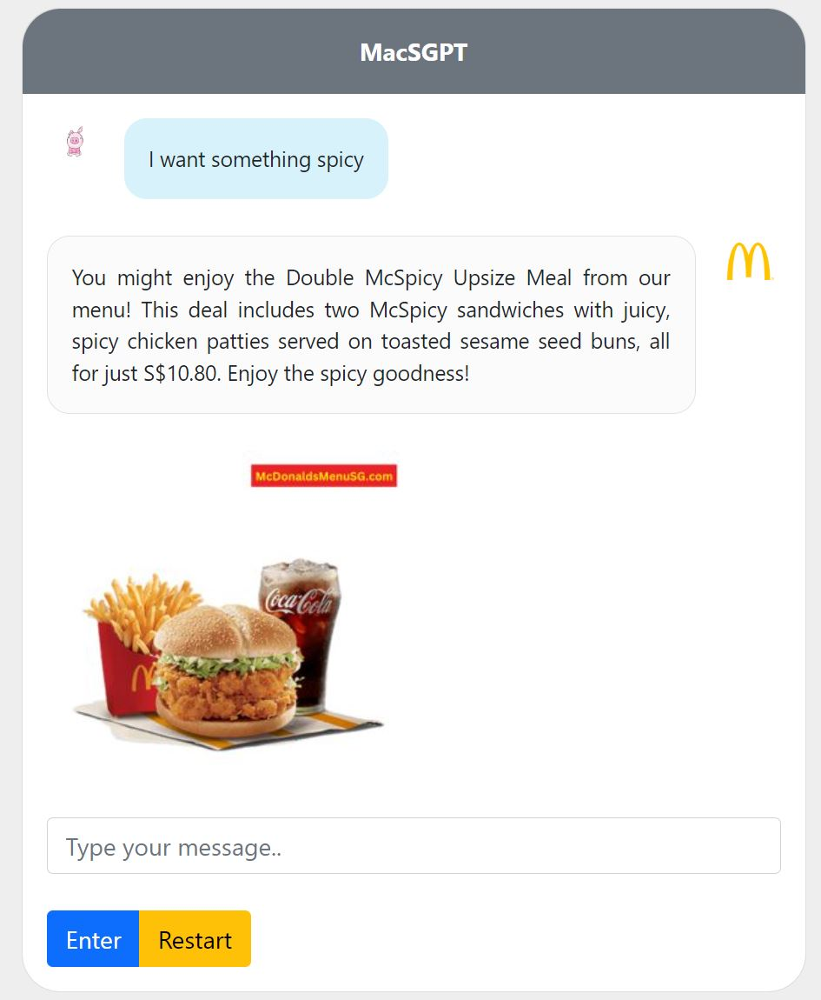
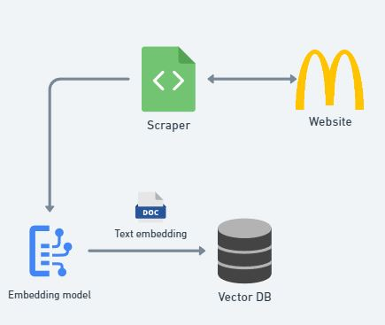
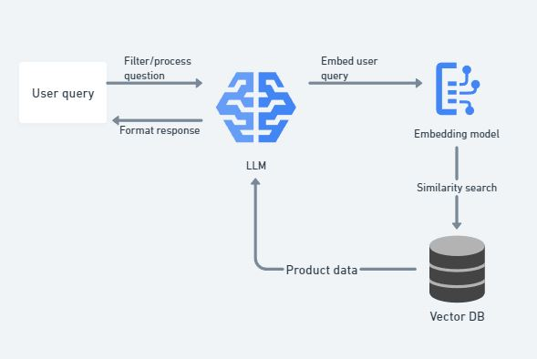

<!-- PROJECT LOGO -->
<br />
<div align="center">
  <a href="https://github.com/Xinyu-ham/sg-mac-menu-search">
    
  </a>

  <h3 align="center">MacsGPT</h3>

  <p align="center">
    Do you ever want to chat with a bot who provides accurate and up-to-date information about McDonald's menu items in Singapore?
    <br />
    <a href="#Installation"><strong>Try it yourself »</strong></a>
    <br />
    <br />
  </p>
</div>

---

<center>
    
</center>

## Installation
1. Clone the repo
    ```bash
    git clone https://github.com/Xinyu-ham/sg-mac-menu-search
    ```
2. Navigate to the project directory
    ```bash
    cd sg-mac-menu-search
    ```
3. Install dependencies
    ```bash
    pip install -r requirements.txt
    ```
4. Install docker and docker-compose
    - Follow the instructions here to install docker:
    https://docs.docker.com/get-started/get-docker/
    - Install docker-compose
    ```bash
    sudo apt-get update
    sudo apt-get install docker-compose-plugin
    ```


## Usage


1. Ensure you have your OpenAI API key stored in environment variable as `OPENAI_API_KEY`
    ```bash
    export OPENAI_API_KEY="<your api key here>"
    ```
2. Start a ElasticSearch local cluster
    ```bash
    docker-compose up -d
    ```
3. Run the app
    ```bash
    python3 -m main
    ```
4. Go to `http://localhost:8000` in your browser to chat with the bot

## Details
The application follows a simple RAG architecture. We first create a database of the menu items by making a scraper, and store the data as documents in a vector database. You can checkout the implementation of the scraper in `scraper.py`.
<center>
    
</center>

In this case, we use ElasticSearch as the vector database. You can checkout the implementation of the database in `vectordb` module.

We then build a RAG architecture on top of the vector database. The idea is to convert the user query into a vector, and then search for the most similar vector in the database. The response is then generated by the an LLM and returned to the user.
<center>
    
</center>

For convenience, I will be using OpenAI's GPT-3.5 to generate the response, and their text-embedding API to convert the user query into a vector. You can checkout the implementation of the chatbot in `chat` module, and embedder in `embedder.py`.